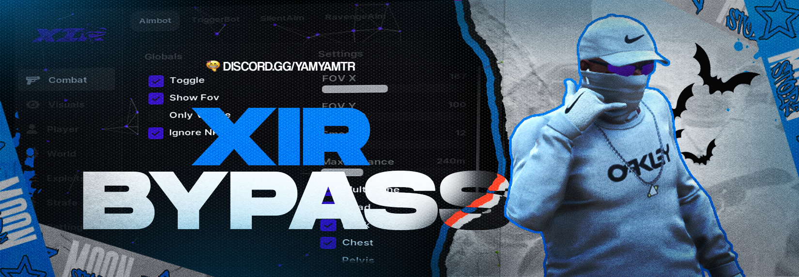

# 🦈 Xir Loader

<p align="center">
  
</p>

<p align="center">
  
  
  
  
</p>

<p align="center">
  📖 <b>English Documentation | <a href="README.tr.md">Türkçe Dökümantasyon</a></b>
</p>

---

## ・What is it?

**Xir** is an **advanced byp4$$ loader and process protection system** designed to securely, stealthily, and trace-free manage, inject, and execute multiple external game modifications and execution tools from a single modern client.

Built with a hybrid architecture of Python and CustomTkinter, Xir features custom-tailored security layers designed to protect the process memory of running instances, stay hidden from screenshot capturers, and leave zero traces on the host system.

---

## ・Key Features・

Xir goes beyond standard launchers, offering full-featured security and interface optimizations:

### ・Clean & Dynamic Interface
* **Particle Effect Background:** Real-time rendering, mouse-interactive dynamic background particle engine.
* **Fluid Transition Animations:** CustomTkinter-based custom color-interpolating smooth hover fade buttons and drop-down menus.
* **Smart Resolution Scaling:** Flexible grid structure that adapts perfectly to different monitor resolutions.
* **Custom Frameless Design:** Borderless draggable window with custom control elements instead of standard Windows titles.

### ・Advanced Security & Anti-Analysis
* **Advanced Memory Encryption:** On-the-fly Memory Encryption & Decryption protecting the process space using AES-CBC encryption.
* **Double-Layered Anti-Debug:** Constantly active rapid (0.1s interval) and advanced background threads checking for debuggers.
* **Anti-Suspension Protection:** Protection layer to prevent debugging tools from suspending and examining the loader process.
* **Honeypot Memory Decoys:** Memory enjections with random timestamps of fake sensitive variables to mislead dump tools.
* **API Hooking Protection:** Monitors critical win32 APIs (e.g. `ReadProcessMemory`, `WriteProcessMemory`, `OpenProcess` in `kernel32.dll`) to detect if they are being hooked.

### ・Deep Trace Cleaning (Clean Utility)
* **Windows Event Log Cleansing:** Automatic cleaning of logs generated during execution.
* **Prefetch & Recent files Clearing:** Cleaning the system directories to prevent analytical recovery of executed files.
* **Registry Traces Arındırması:** Cleaning execution paths in the Windows Registry (MRU keys).

### ・Screen Recorder Protection (Stream-Proof)
* **Screen Capturing Bypass:** Windows API display affinity protection that blocks the loader's window from appearing on Discord, OBS, AMD Software, NVIDIA ShadowPlay, and AnyDesk.

---

## ・Technical Requirements & Installation

It is recommended to have Python 3.10 or higher installed to run the project smoothly.

### Requirements
Install the necessary components using the command below:
```bash
pip install customtkinter pillow pycryptodome psutil wmi win10toast plyer pypiwin32 socketio requests opencv-python pygame
```

### Execution
To test or run the project in non-compiled (source code) mode:
```bash
python main.py
```

---

### ⚠️ Important Notice:
To hide itself from memory scanners, Xir runs in RAM under a standard Python process. Therefore, compiling the main file into an EXE is not recommended. Use `setup.py` only for a one-time initial installation setup.

---

## ・File Structure & Explanations

* `main.py`: The main execution script containing the UI, CustomTkinter animations, and security threads (`SecurityManager`).
* `setup.py`: The installation setup script that deploys the files to target directories, performs HWID calculation, and verifies dependencies.
* `version.txt`: The version resource metadata definition used to make the compiled installation setup executable look legitimate.
* `req.bat`: A simple batch file designed to automate requirements installation with one click.

---

## ・Wallpapers and Banners Showcase

The project assets include professional high-quality custom wallpapers and banners that you can find under the following directories:

---

## ・Usage & Configuration

For full execution guidelines and options, visit the detailed documentation page:
👉 [Xir Setup Guide & In-Depth Analysis](https://justpaste.it/jufae)

---

## ・Disclaimer

This software is developed strictly for **educational, research, and personal security analysis purposes**. Any usage of this tool in violation of third-party platforms or game terms of service rests solely with the end user. The developer (Latei) accepts no responsibility for any misuse.

### Banners
* **Latei Banner 1 (Main Visual):** `lateibanner.png`
* **Latei Banner 2 (Alternative):** `lateibanner2.png`

### Wallpapers
* **Latei Wallpaper 1:** `lateiwallpaper.png`
* **Latei Wallpaper 2:** `lateiwallpaper2.png`
* **Latei Wallpaper 3:** `lateiwallpaper3.png`

---
<p align="center">Developed with ❤️ by <b>Latei</b></p>
